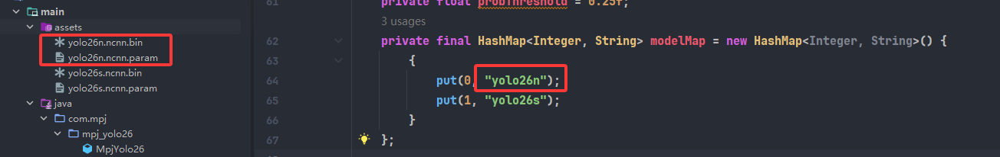
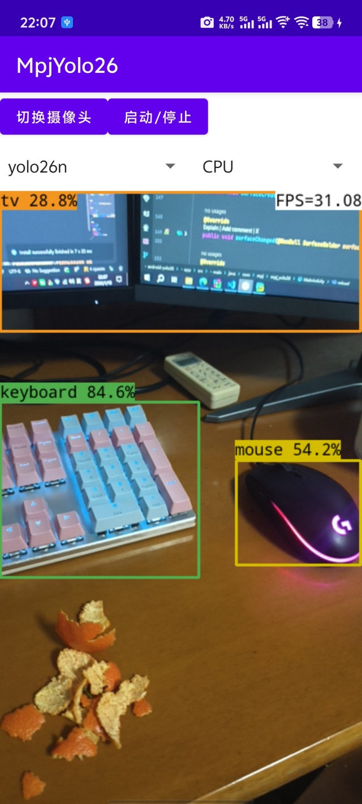
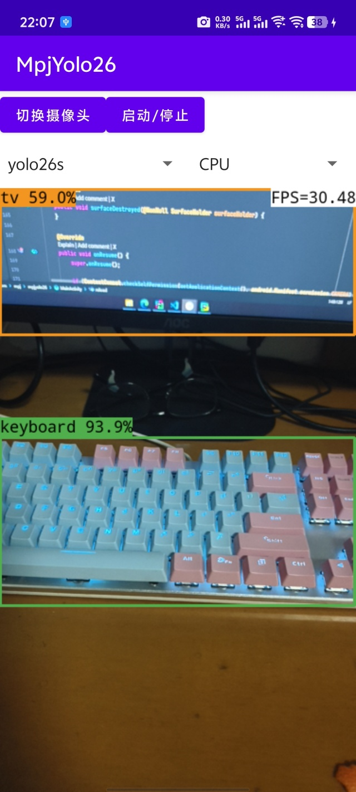
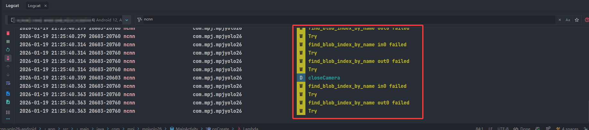

# ncnn-yolo26-android
Yolo26 model supports android deployment.

## Please, have some stars for this repo. Thank you! 🌟🌟🌟🌟🌟

## Experience APK download address:

[APK](https://github.com/mpj1234/ncnn-yolo26-android/releases/download/asserts/app-release.APK)

https://github.com/mpj1234/ncnn-yolo26-android/releases/download/asserts/app-release.APK

## Update to Custom Model

### 1. export ncnn model

Download the [code](https://github.com/mpj1234/ncnn-yolo26-android/releases/download/asserts/ultralytics-8.4.6.zip) base supporting YOLO26 to export ncnn model:
```bash
wget https://github.com/mpj1234/ncnn-yolo26-android/releases/download/asserts/ultralytics-8.4.6.zip
unzip ultralytics-8.4.6.zip
```

### 2. Installation environment

```bash
cd ultralytics-8.4.6
pip install -e .
pip install pnnx ncnn
```

### 3. Export ncnn model

```bash
cd ultralytics-8.4.6
python ./export.py -p weights/yolo26n.pt
# -p: path to your custom model
```

Test whether the model is normal:

```bash
python ./weights/yolo26n_ncnn_model/model_ncnn.py 
````

Modify ncnn file name

```bash
mv weights/yolo26n_ncnn_model/model.ncnn.param weights/yolo26n_ncnn_model/yolo26n.ncnn.param
mv weights/yolo26n_ncnn_model/model.ncnn.bin weights/yolo26n_ncnn_model/yolo26n.ncnn.bin
```

### 4. Replace model files in android project

Copy the generated `yolo26n.ncnn.param` and `yolo26n.ncnn.bin` files to the `app/src/main/assets/` directory of this android project, replacing the existing files.

Change the model file name in `app/src/main/java/com/mpj/mpjyolo26/MainActivity.java` to your model file name (if different).



Change the model file name in `app/src/main/res/values/strings.xml` to your model file name (if different).


### 5. Build and run the android project

Open the android project in Android Studio, build and run it on your android device.

## Visualization result

<table>
  <tr>
    <td></td>
    <td></td>
    <td></td>
  </tr>
</table>

## logcat result


